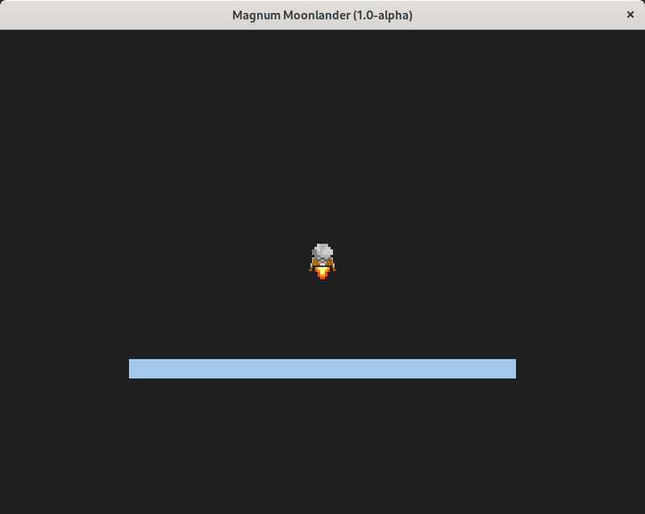

# Moonlander

This is an example implementation of the classic moonlander game in C++
using the [Magnum](https://github.com/mosra/magnum) graphics engine.



## Linux Instructions

### Fedora
Use [package distro](https://github.com/alkavan/magnum-rpm) on Fedora and other RPM variants. 

## Windows Instructions
Install [vcpkg](https://vcpkg.io/) dependency manager.

**Install Corrade**
```
.\vcpkg install corrade --head
```

**Install Magnum**
```
.\vcpkg install magnum --head
.\vcpkg install magnum-plugins --head
.\vcpkg install magnum-integration --head
.\vcpkg install magnum-extras --head
```

**Install Box2D**
```
.\vcpkg install box2d
```
